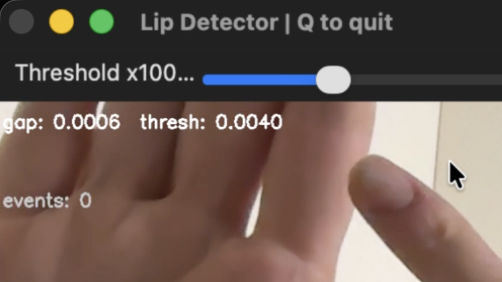
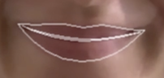
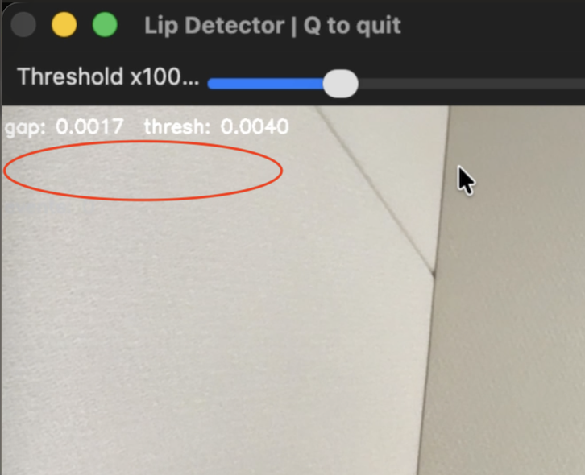
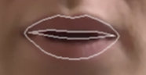
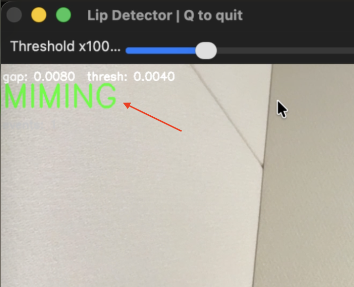
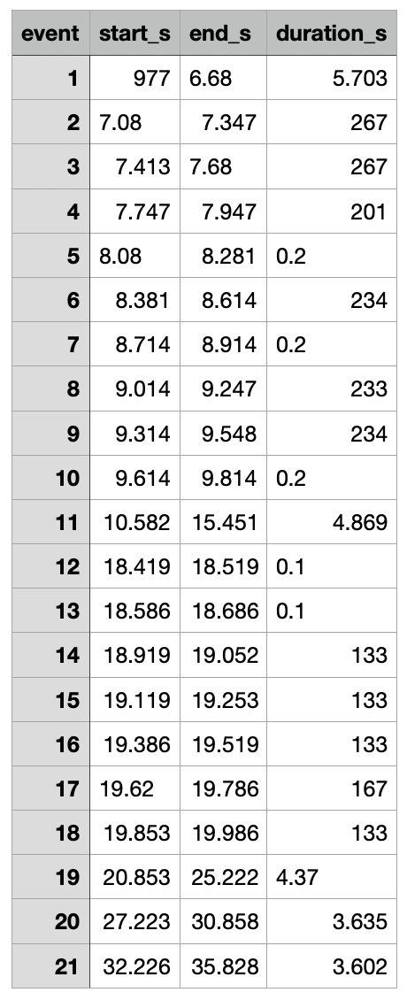

# Lip-Parting Detector (for Silent speech etc.)

Real-time lip-parting detection using MediaPipe face landmarks and OpenCV. Creates a GUI with realtime lip detection and live-threshold control via slider. Writes out a .csv with timestamped parting events. Built for detecting silent speech miming via webcam.

## How it works

The script tracks two inner-lip landmarks (indices 13 & 14) from MediaPipe's face landmarker and computes the normalised vertical gap between them. When the gap exceeds a threshold, a "MIMING" flag is shown on-screen. Events (start, end, duration) are logged and exported to CSV.

The threshold is adjustable live via a GUI slider — useful because the optimal value varies between subjects (e.g., facial hair and camera angle affect it).

## Demo

**GUI with live threshold slider and gap readout:**



**Lip landmark overlay — lips closed (below threshold):**

<p align="center">
    
    
</p>

**Lips parted — detection triggered:**

<p align="center">
    
    
</p>

## Quick start

```bash
python MediaPipe_LipParting_QuickDemo.py
```

Dependencies (`mediapipe`, `opencv-python`) and the face landmark model are downloaded automatically on first run. Press **Q** to quit the GUI.

## CSV Export



When you quit the GUI (press **Q**), all detected lip-parting events are written to a `.csv` file with four columns:

- **event** — sequential event number
- **start_s** — event start time (seconds since script launch)
- **end_s** — event end time
- **duration_s** — how long the lips were parted (milliseconds)

This makes it easy to analyse miming patterns, count events, or feed the data into downstream processing.

<br clear="right">

## Configuration

All tuneable parameters are at the top of the script in the "Master":

| Parameter | Default | Description |
|---|---|---|
| `LIP_OPEN_THRESHOLD` | 0.004 | Starting threshold (adjustable live via slider) |
| `EXPORT_CSV` | True | Toggle CSV event export |
| `CSV_FILENAME` | `lipparty_events.csv` | Output filename |
| `FLAGMESSAGE` | `MIMING` | On-screen alert text |
